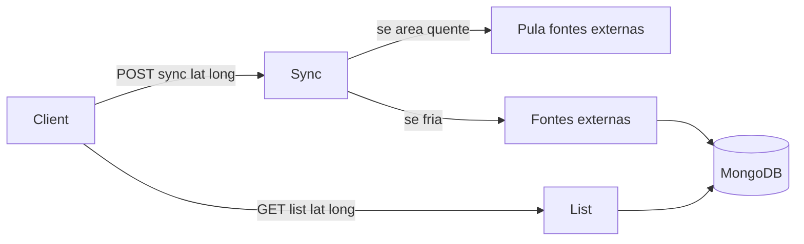

# Patamar Gateway External

Serviço que busca eventos de fontes públicas (Sympla, Ticketmaster, agenda de Curitiba, etc.), guarda no banco e devolve para o app por **latitude e longitude**.

Ideia simples: na primeira busca de uma cidade, a API “esquenta” um **radar** de cerca de **25 km**. Quem estiver perto reaproveita o mesmo cache por algumas horas, sem ficar pedindo de novo nas fontes externas.

---

## Guia rápido (para quem não é de TI)

### O que você precisa

Só o **Docker Desktop**. Com ele, a API e o banco sobem sozinhos — não precisa instalar .NET nem MongoDB na mão.

| Sistema | O que instalar |
|---------|----------------|
| Windows 10/11 | [Docker Desktop para Windows](https://www.docker.com/products/docker-desktop/) |
| macOS | [Docker Desktop para Mac](https://www.docker.com/products/docker-desktop/) |
| Linux | Docker Engine + plugin Compose ([docs oficiais](https://docs.docker.com/engine/install/)) |

**Dicas na instalação do Docker Desktop**

1. Baixe o instalador no site oficial e execute.
2. No Windows, se pedir, ative o **WSL 2** e reinicie o PC.
3. Abra o **Docker Desktop** e espere o status ficar **Running** (pronto para uso).
4. Aceite os termos se aparecerem.

Chaves opcionais (não são obrigatórias para começar):

- `SYMPLA_TOKEN` — eventos oficiais da sua conta Sympla
- `TICKETMASTER_API_KEY` — eventos Ticketmaster

Sem elas, ainda funciona com fontes públicas (ex.: Sympla public / Curitiba PMC).

---

### Como ligar a API (automático)

1. Baixe ou clone este projeto para uma pasta no computador.
2. Abra o **Docker Desktop** e deixe-o rodando.
3. Na pasta do projeto, rode o script do seu sistema:

**Windows**

- Abra a pasta `scripts` e clique duas vezes em `start.bat`  
  **ou** no Prompt/PowerShell, na pasta do projeto:

```bat
scripts\start.bat
```

**macOS / Linux**

```bash
chmod +x scripts/start.sh scripts/stop.sh
./scripts/start.sh
```

O script vai:

1. Conferir se o Docker está instalado e ligado  
2. Criar o arquivo `.env` (se ainda não existir)  
3. Baixar/montar a API e o banco  
4. Esperar a API responder em http://localhost:8080/health  

Quando terminar, a API fica em:

- **API:** http://localhost:8080  
- **Saúde:** http://localhost:8080/health (deve mostrar `Healthy`)

Na primeira vez pode demorar alguns minutos (download das imagens).

---

### Como parar

**Windows:** clique duas vezes em `scripts\stop.bat`  
**macOS / Linux:** `./scripts/stop.sh`

---

### Como testar sem ser programador

1. Abra no navegador: http://localhost:8080/health  
   Se aparecer `Healthy`, está ok.
2. (Opcional) Use o [Postman](https://www.postman.com/downloads/):
   - Importe `postman/Patamar.Gateway.External.postman_collection.json`
   - Selecione o environment **Patamar Gateway Local** (ou use as variáveis da collection: lat/long de Curitiba)
   - Rode **Sync Sympla Public**, depois **List Events In Radar**

Exemplo de Curitiba (centro):

| Ação | Método | Endereço |
|------|--------|----------|
| Buscar e guardar eventos | POST | `http://localhost:8080/api/events/sync?lat=-25.4284&long=-49.2733&provider=sympla-public` |
| Listar eventos do radar | GET | `http://localhost:8080/api/events?lat=-25.4284&long=-49.2733` |

Sem `lat` e `long` a API responde erro — isso é esperado.

---

### Problemas comuns

| Situação | O que fazer |
|----------|-------------|
| “Docker não encontrado” | Instale o Docker Desktop e reinicie o PC |
| “Docker não está em execução” | Abra o Docker Desktop e espere ficar Running |
| Porta 8080 ocupada | Feche o outro programa na 8080 ou mude a porta no `docker-compose.yml` |
| API sobe mas /health não abre | Espere 1–2 minutos e atualize a página; veja logs com `docker compose logs api` |
| Sync volta tudo zerado | Confira internet; para Ticketmaster/Sympla oficial, preencha as chaves no `.env` |

---

## Conceito do radar (resumo)

1. Cliente chama **sync** com `lat` + `long`  
2. API cria um radar (~**25 km**)  
3. Busca nas fontes e salva só eventos **dentro do raio**  
4. Cliente chama **list** com `lat` + `long` → lê só o banco (sem ir nas fontes de novo)  
5. Quem estiver na mesma área reaproveita o cache (~**6 h**). Para forçar nova busca: `force=true`



---

## Fontes (providers)

| Provider | Origem | Observação |
|----------|--------|------------|
| `sympla` | API oficial Sympla | Só eventos da conta (precisa token) |
| `sympla-public` | Busca pública Sympla | Catálogo amplo (não oficial) |
| `curitiba-pmc` | Dados Abertos Curitiba | Agenda municipal |
| `ticketmaster` | Ticketmaster Discovery | Precisa API key |
| `all` | Todas acima | Continua mesmo se uma falhar |

---

## Endpoints

| Método | Rota | Obrigatório | Descrição |
|--------|------|-------------|-----------|
| `GET` | `/api/events` | `lat`, `long` | Lista eventos em cache no raio |
| `POST` | `/api/events/sync` | `lat`, `long` | Sincroniza fontes no radar |
| `GET` | `/health` | — | Saúde do serviço |

Opcionais:

- `radiusKm` — raio em km (1–100, padrão 25)
- `provider` — `all`, `sympla`, `sympla-public`, `curitiba-pmc`, `ticketmaster`
- `force` — `true` para ignorar cache quente no sync

Eventos na listagem: **futuros mais próximos de agora** primeiro; depois passados recentes.

---

## Configuração (arquivo `.env`)

Copiado automaticamente pelo `scripts/start.bat` / `scripts/start.sh` a partir de `.env.example`.

| Variável | Padrão | Significado |
|----------|--------|-------------|
| `SYMPLA_TOKEN` | (vazio) | Token da API oficial Sympla |
| `TICKETMASTER_API_KEY` | (vazio) | Chave Ticketmaster |
| `CURITIBA_PMC_GEOCODING` | `true` | Geocodifica endereços da PMC |
| `CURITIBA_PMC_GEOCODE_MAX` | `40` | Limite de geocodes por sync |
| `RADAR_CITY_RADIUS_KM` | `25` | Raio do radar (cidade média) |
| `RADAR_SYNC_TTL_HOURS` | `6` | Tempo que o radar fica “quente” |

---

## Postman

Arquivo local: [`postman/Patamar.Gateway.External.postman_collection.json`](postman/Patamar.Gateway.External.postman_collection.json)

No workspace Postman: collection **Patamar Gateway External** + environment **Patamar Gateway Local**.

---

## Modelo de evento

- Campos: `Id`, `Name`, `StartDate`, `EndDate`, `Lat`, `Long`, `Source`
- Chave de upsert: `(Source, Id)`
- Índice geo em `Location` (GeoJSON Point)

---

## Observações técnicas

- List/sync **exigem** coordenadas. Eventos sem lat/long não entram no cache do radar.
- Dados da PMC de Curitiba podem ser históricos; para catálogo atual, prefira `sympla-public`.
- `sympla-public` é não oficial e pode mudar.
- Alternativa manual (sem script): `docker compose up --build`
